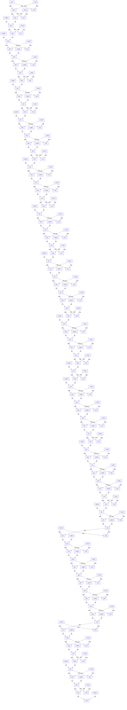

## Graph showing the associations

```mermaid
graph TD;
    vgs-->|OR| bjt;
    and41-->|OR| bjt;
    y00-->|AND| c00;
    x00-->|AND| c00;
    and01-->|OR| c01;
    d01-->|OR| c01;
    and02-->|OR| c02;
    d02-->|OR| c02;
    d03-->|OR| c03;
    and03-->|OR| c03;
    d04-->|OR| c04;
    and04-->|OR| c04;
    and05-->|OR| c05;
    d05-->|OR| c05;
    d06-->|OR| c06;
    and06-->|OR| c06;
    and07-->|OR| c07;
    d07-->|OR| c07;
    d08-->|OR| c08;
    and08-->|OR| c08;
    d09-->|OR| c09;
    and09-->|OR| c09;
    and10-->|OR| c10;
    d10-->|OR| c10;
    d11-->|OR| c11;
    and11-->|OR| c11;
    d12-->|OR| c12;
    and12-->|OR| c12;
    and13-->|OR| c13;
    d13-->|OR| c13;
    d14-->|OR| c14;
    and14-->|OR| c14;
    d15-->|OR| c15;
    and15-->|OR| c15;
    and16-->|OR| c16;
    d16-->|OR| c16;
    d17-->|OR| c17;
    and17-->|OR| c17;
    d18-->|OR| c18;
    and18-->|OR| c18;
    d19-->|OR| c19;
    and19-->|OR| c19;
    and20-->|OR| c20;
    d20-->|OR| c20;
    d21-->|OR| c21;
    and21-->|OR| c21;
    d22-->|OR| c22;
    and22-->|OR| c22;
    and23-->|OR| c23;
    d23-->|OR| c23;
    and24-->|OR| c24;
    d24-->|OR| c24;
    d25-->|OR| c25;
    and25-->|OR| c25;
    d26-->|OR| c26;
    and26-->|OR| c26;
    d27-->|OR| c27;
    and27-->|OR| c27;
    and42-->|OR| cjb;
    hgm-->|OR| cjb;
    xor34-->|AND| cpb;
    tkg-->|AND| cpb;
    dng-->|AND| crb;
    xor31-->|AND| crb;
    c00-->|AND| d01;
    xor01-->|AND| d01;
    xor02-->|AND| d02;
    c01-->|AND| d02;
    c02-->|AND| d03;
    xor03-->|AND| d03;
    c03-->|AND| d04;
    xor04-->|AND| d04;
    xor05-->|AND| d05;
    c04-->|AND| d05;
    xor06-->|AND| d06;
    c05-->|AND| d06;
    c06-->|AND| d07;
    xor07-->|AND| d07;
    xor08-->|AND| d08;
    c07-->|AND| d08;
    xor09-->|AND| d09;
    c08-->|AND| d09;
    xor10-->|AND| d10;
    c09-->|AND| d10;
    c10-->|AND| d11;
    xor11-->|AND| d11;
    xor12-->|AND| d12;
    c11-->|AND| d12;
    xor13-->|AND| d13;
    c12-->|AND| d13;
    c13-->|AND| d14;
    xor14-->|AND| d14;
    c14-->|AND| d15;
    xor15-->|AND| d15;
    xor16-->|AND| d16;
    c15-->|AND| d16;
    xor17-->|AND| d17;
    c16-->|AND| d17;
    xor18-->|AND| d18;
    c17-->|AND| d18;
    xor19-->|AND| d19;
    c18-->|AND| d19;
    xor20-->|AND| d20;
    c19-->|AND| d20;
    c20-->|AND| d21;
    xor21-->|AND| d21;
    c21-->|AND| d22;
    xor22-->|AND| d22;
    xor23-->|AND| d23;
    c22-->|AND| d23;
    c23-->|AND| d24;
    xor24-->|AND| d24;
    c24-->|AND| d25;
    xor25-->|AND| d25;
    c25-->|AND| d26;
    xor26-->|AND| d26;
    xor27-->|AND| d27;
    c26-->|AND| d27;
    jpf-->|OR| dkp;
    and37-->|OR| dkp;
    rwc-->|OR| dng;
    and30-->|OR| dng;
    and32-->|OR| fdj;
    rvw-->|OR| fdj;
    qhh-->|OR| frv;
    and29-->|OR| frv;
    xor28-->|OR| ftq;
    jnk-->|OR| ftq;
    bjt-->|AND| hgm;
    xor42-->|AND| hgm;
    dkp-->|XOR| hqh;
    xor38-->|XOR| hqh;
    stq-->|OR| hqn;
    and36-->|OR| hqn;
    ngc-->|AND| hrj;
    xor35-->|AND| hrj;
    and38-->|OR| hth;
    hqh-->|OR| hth;
    c27-->|AND| jnk;
    and28-->|AND| jnk;
    xor37-->|AND| jpf;
    hqn-->|AND| jpf;
    xor40-->|AND| jvt;
    ssv-->|AND| jvt;
    crb-->|OR| mrh;
    and31-->|OR| mrh;
    and34-->|OR| ngc;
    cpb-->|OR| ngc;
    xor33-->|AND| pft;
    fdj-->|AND| pft;
    and35-->|OR| pmk;
    hrj-->|OR| pmk;
    ftq-->|AND| qhh;
    xor29-->|AND| qhh;
    xor39-->|AND| qvm;
    hth-->|AND| qvm;
    mrh-->|AND| rvw;
    xor32-->|AND| rvw;
    frv-->|AND| rwc;
    xor30-->|AND| rwc;
    and39-->|OR| ssv;
    qvm-->|OR| ssv;
    xor36-->|AND| stq;
    pmk-->|AND| stq;
    wrg-->|AND| tcg;
    xor44-->|AND| tcg;
    and33-->|OR| tkg;
    pft-->|OR| tkg;
    vwh-->|AND| vgs;
    xor41-->|AND| vgs;
    and40-->|OR| vwh;
    jvt-->|OR| vwh;
    xor43-->|AND| wgc;
    cjb-->|AND| wgc;
    and43-->|OR| wrg;
    wgc-->|OR| wrg;
    y00-->|XOR| z00;
    x00-->|XOR| z00;
    xor01-->|XOR| z01;
    c00-->|XOR| z01;
    c01-->|XOR| z02;
    xor02-->|XOR| z02;
    xor03-->|XOR| z03;
    c02-->|XOR| z03;
    c03-->|XOR| z04;
    xor04-->|XOR| z04;
    xor05-->|XOR| z05;
    c04-->|XOR| z05;
    c05-->|XOR| z06;
    xor06-->|XOR| z06;
    c06-->|XOR| z07;
    xor07-->|XOR| z07;
    xor08-->|XOR| z08;
    c07-->|XOR| z08;
    xor09-->|XOR| z09;
    c08-->|XOR| z09;
    c09-->|XOR| z10;
    xor10-->|XOR| z10;
    c10-->|XOR| z11;
    xor11-->|XOR| z11;
    c11-->|XOR| z12;
    xor12-->|XOR| z12;
    xor13-->|XOR| z13;
    c12-->|XOR| z13;
    c13-->|XOR| z14;
    xor14-->|XOR| z14;
    xor15-->|XOR| z15;
    c14-->|XOR| z15;
    c15-->|XOR| z16;
    xor16-->|XOR| z16;
    c16-->|XOR| z17;
    xor17-->|XOR| z17;
    xor18-->|XOR| z18;
    c17-->|XOR| z18;
    xor19-->|XOR| z19;
    c18-->|XOR| z19;
    xor20-->|XOR| z20;
    c19-->|XOR| z20;
    xor21-->|XOR| z21;
    c20-->|XOR| z21;
    xor22-->|XOR| z22;
    c21-->|XOR| z22;
    c22-->|XOR| z23;
    xor23-->|XOR| z23;
    c23-->|XOR| z24;
    xor24-->|XOR| z24;
    xor25-->|XOR| z25;
    c24-->|XOR| z25;
    xor26-->|XOR| z26;
    c25-->|XOR| z26;
    c26-->|XOR| z27;
    xor27-->|XOR| z27;
    and28-->|XOR| z28;
    c27-->|XOR| z28;
    ftq-->|XOR| z29;
    xor29-->|XOR| z29;
    frv-->|XOR| z30;
    xor30-->|XOR| z30;
    dng-->|XOR| z31;
    xor31-->|XOR| z31;
    mrh-->|XOR| z32;
    xor32-->|XOR| z32;
    xor33-->|XOR| z33;
    fdj-->|XOR| z33;
    tkg-->|XOR| z34;
    xor34-->|XOR| z34;
    ngc-->|XOR| z35;
    xor35-->|XOR| z35;
    pmk-->|XOR| z36;
    xor36-->|XOR| z36;
    hqn-->|XOR| z37;
    xor37-->|XOR| z37;
    xor38-->|AND| z38;
    dkp-->|AND| z38;
    hth-->|XOR| z39;
    xor39-->|XOR| z39;
    ssv-->|XOR| z40;
    xor40-->|XOR| z40;
    vwh-->|XOR| z41;
    xor41-->|XOR| z41;
    bjt-->|XOR| z42;
    xor42-->|XOR| z42;
    xor43-->|XOR| z43;
    cjb-->|XOR| z43;
    wrg-->|XOR| z44;
    xor44-->|XOR| z44;
    tcg-->|OR| z45;
    and44-->|OR| z45;
```
